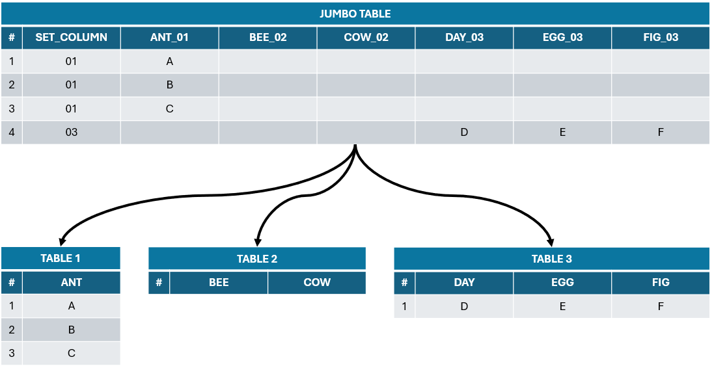

# csharp-jumbo-dataset-parser

This repository contains a class library with unit tests for parsing jumbo datatables into individual tables.

[TeraData](https://www.teradata.com/) and other database solutions typically allow multiple tables to be returned when executing a stored procedure. [Snowflake](https://www.snowflake.com/en/), however, only allows **one** table to be returned. This limitation can be overcome by [outer joining](https://www.w3schools.com/sql/sql_join_full.asp) all tables into one jumbo datatable, while adding a column that ties each row to an individual table.

